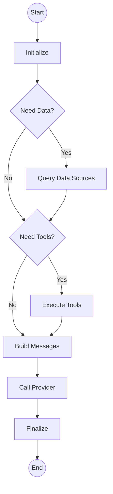

# Workflow Engine Architecture

## Overview

The **Workflow Engine** (`backend/brain/cortex/workflow_engine.py`) is the execution arm of the Brain. It uses a **LangGraph-based state machine** to orchestrate the lifecycle of an LLM request.

## Architecture

The engine operates on a standard loop:
`Initialize` -> `Data Sources` -> `Tools` -> `Build Messages` -> `Call Provider` -> `Finalize`

### State Machine (LangGraph)



### Key Components

1.  **WorkflowState (`TypedDict`):**
    *   Stores the entire context of the execution (request, specs, results, errors, history).
    *   Passed between all nodes in the graph.

2.  **WorkflowEngine Class:**
    *   **`execute_plan`:** Entry point. Takes an `ExecutionPlan` and runs the graph.
    *   **Nodes:**
        *   `_query_data_sources_node`: Fetches data from Vector DB, etc.
        *   `_execute_tools_node`: Runs MCP tools.
        *   `_build_messages_node`: Constructs the final prompt (System + Context + User).
        *   `_call_provider_node`: Invokes the LLM (OpenAI, etc.).

3.  **Provider Registry:**
    *   The engine dynamically loads the correct provider (e.g., `OpenAIProvider`) based on `specs.provider`.

## Integration

### Input: `ExecutionPlan`
The engine receives a fully formed plan from Cortex. It does **not** decide *what* to do, only *how* to execute it.

```python
class ExecutionPlan:
    optimized_specs: AgentExecutionSpec  # What to run
    reasoning_notes: Dict                # Why we are running it
    # ...
```

### Output: `Dict`
Returns a standardized result dictionary:

```python
{
    "success": True,
    "content": "Hello world...",
    "execution_id": "uuid...",
    "metadata": {
        "execution_steps": ["initialize", "call_provider", ...],
        "duration_seconds": 1.2
    },
    "execution_plan": {...} # The plan that was executed
}
```

## Observability

Every step is decorated with `@observe` (Langfuse) to track:
*   Inputs/Outputs of each node.
*   Latency of data fetching vs LLM generation.
*   Full error stacks if failure occurs.

## Extending

To add a new step (e.g., "Safety Check Node"):
1.  Define `_safety_check_node` method.
2.  Add it to the graph in `_build_graph`: `workflow.add_node("safety_check", self._safety_check_node)`.
3.  Update edges to route through it.
